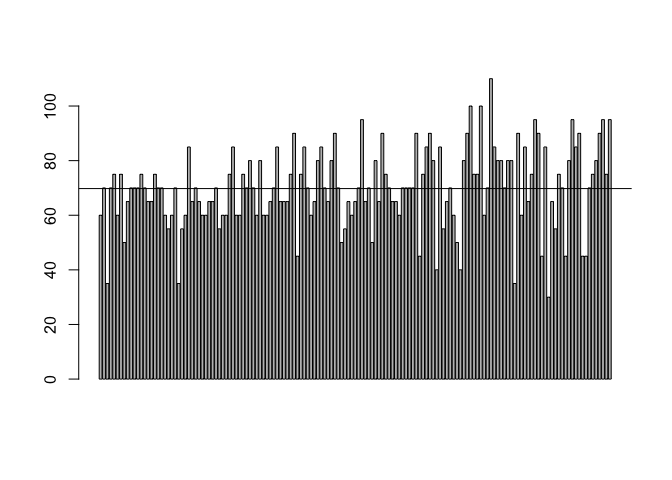
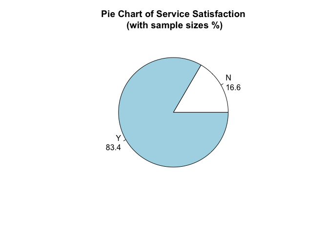
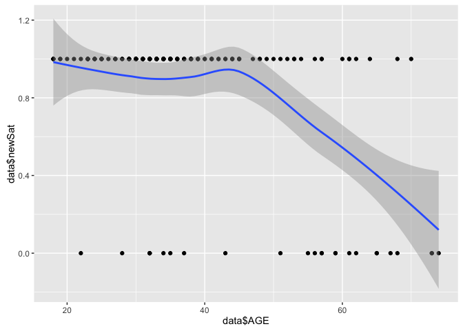
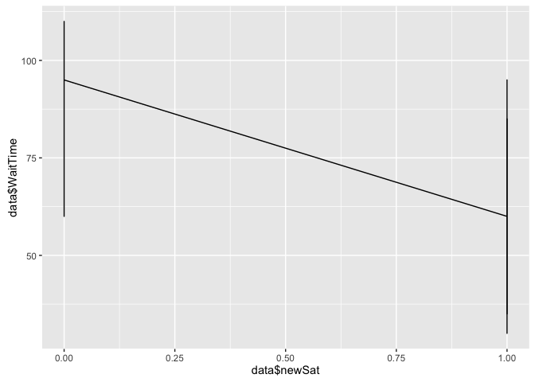
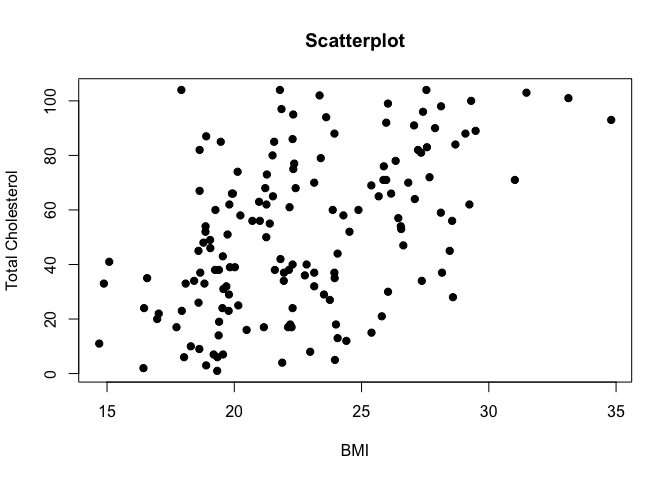

1a i)
-----

    ## [1] "Statistical Index:  69.7682119205298"

  
The KPI of Waiting time is 69.77

1a ii)
------

  
The KPI of Service Satisfaction is 83.4%

1b
--

  

    ## 
    ## Call:
    ## lm(formula = data$newSat ~ data$AGE + data$newGen)
    ## 
    ## Residuals:
    ##      Min       1Q   Median       3Q      Max 
    ## -0.98897 -0.03686  0.06771  0.17264  0.51381 
    ## 
    ## Coefficients:
    ##              Estimate Std. Error t value Pr(>|t|)    
    ## (Intercept)  1.327333   0.082951  16.001  < 2e-16 ***
    ## data$AGE    -0.011971   0.002036  -5.880 2.62e-08 ***
    ## data$newGen -0.074997   0.055062  -1.362    0.175    
    ## ---
    ## Signif. codes:  0 '***' 0.001 '**' 0.01 '*' 0.05 '.' 0.1 ' ' 1
    ## 
    ## Residual standard error: 0.3335 on 148 degrees of freedom
    ## Multiple R-squared:  0.2111, Adjusted R-squared:  0.2005 
    ## F-statistic:  19.8 on 2 and 148 DF,  p-value: 2.394e-08

As we can see the p-value is small, there is negative coefficient
between Service Satisfation and AGE.  
The slope is negative for Age, it shows us that younger people has
higher service satisfaction.  
The slope is negative for Gender, it shows us that female has higher
service satisfaction than male.

1c
--

    ## 
    ##  Pearson's product-moment correlation
    ## 
    ## data:  data$newSat and data$WaitTime
    ## t = -7.6159, df = 149, p-value = 2.793e-12
    ## alternative hypothesis: true correlation is not equal to 0
    ## 95 percent confidence interval:
    ##  -0.6353489 -0.4037482
    ## sample estimates:
    ##        cor 
    ## -0.5293395

  
It has a -0.53, a strong negative correlation between wait time and
service satisfaction.  
It shows that shorter wait time has higher service satisfaction.

1d
--

    ## 
    ##  Pearson's product-moment correlation
    ## 
    ## data:  data$BMI and as.integer(data$TC)
    ## t = 6.7947, df = 149, p-value = 2.431e-10
    ## alternative hypothesis: true correlation is not equal to 0
    ## 95 percent confidence interval:
    ##  0.3541533 0.5995221
    ## sample estimates:
    ##       cor 
    ## 0.4863686

  
It has a 0.48, a medium positive correlation between bmi and total
cholesterol.  
A higher BMI may lead to High Total Cholesterol.

1e
--

    ##        1 
    ## 29.78424

The predicted BMI is 29.78  
The assumption is that there is correlation between BMI and age,
systolic blood pressure, total cholesterol.  
But this does not imply there is casuation.
