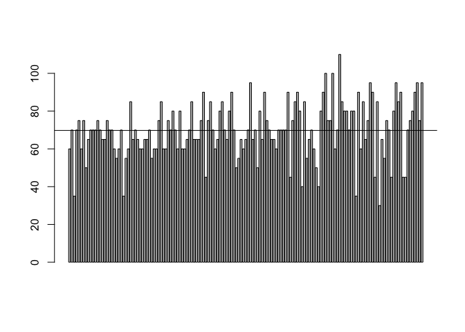
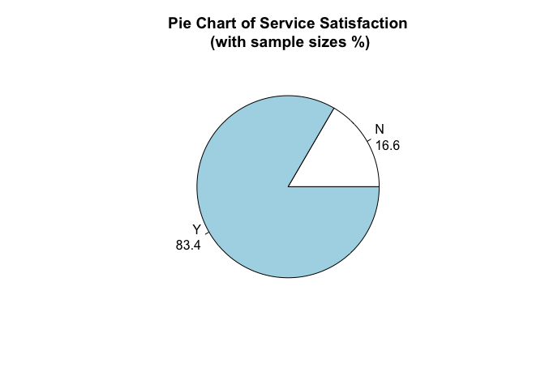
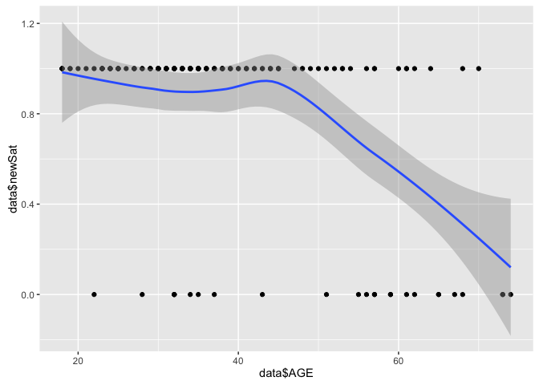
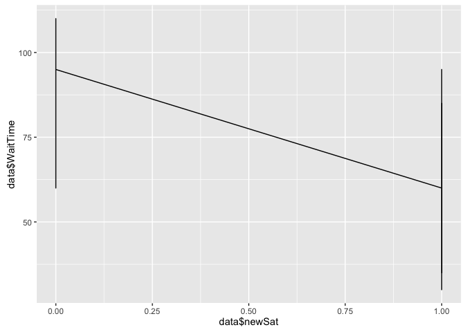

    ## [1] "1a i)"

    ## [1] "Statistical Index:  69.7682119205298"

  

    ## [1] "The KPI of Waiting time is 69.77"

    ## [1] "1a ii)"

  

    ## [1] "The KPI of Service Satisfaction is 83.4%"

    ## [1] "1b"

    ## [1] 151

  

    ## 
    ## Call:
    ## lm(formula = data$newSat ~ data$AGE + data$newGen)
    ## 
    ## Residuals:
    ##      Min       1Q   Median       3Q      Max 
    ## -0.98897 -0.03686  0.06771  0.17264  0.51381 
    ## 
    ## Coefficients:
    ##              Estimate Std. Error t value Pr(>|t|)    
    ## (Intercept)  1.327333   0.082951  16.001  < 2e-16 ***
    ## data$AGE    -0.011971   0.002036  -5.880 2.62e-08 ***
    ## data$newGen -0.074997   0.055062  -1.362    0.175    
    ## ---
    ## Signif. codes:  0 '***' 0.001 '**' 0.01 '*' 0.05 '.' 0.1 ' ' 1
    ## 
    ## Residual standard error: 0.3335 on 148 degrees of freedom
    ## Multiple R-squared:  0.2111, Adjusted R-squared:  0.2005 
    ## F-statistic:  19.8 on 2 and 148 DF,  p-value: 2.394e-08

    ## [1] "As we can see the p-value is small, there is correlationship between Service Satisfation and AGE"

    ## [1] "the slope is negative for Age, it shows us that younger people has higher service satisfaction."

    ## [1] "the slope is negative for Gender, it shows us that female has higher service satisfaction than male."

    ## [1] "1c"

    ## 
    ## Call:
    ## lm(formula = data$newSat ~ data$WaitTime)
    ## 
    ## Residuals:
    ##     Min      1Q  Median      3Q     Max 
    ## -0.9685 -0.1058  0.1001  0.1687  0.5119 
    ## 
    ## Coefficients:
    ##                Estimate Std. Error t value Pr(>|t|)    
    ## (Intercept)    1.792204   0.128385  13.960  < 2e-16 ***
    ## data$WaitTime -0.013728   0.001803  -7.616 2.79e-12 ***
    ## ---
    ## Signif. codes:  0 '***' 0.001 '**' 0.01 '*' 0.05 '.' 0.1 ' ' 1
    ## 
    ## Residual standard error: 0.3175 on 149 degrees of freedom
    ## Multiple R-squared:  0.2802, Adjusted R-squared:  0.2754 
    ## F-statistic:    58 on 1 and 149 DF,  p-value: 2.793e-12

  

    ## [1] "It shows that shorter wait time has higher service satisfaction."

    ## [1] "1d"

    ## [1] 15.08631 16.57583 14.69238 14.87603 16.43069 17.93781

    ##   [1] 15.08631 16.57583 14.69238 14.87603 16.43069 17.93781 18.42259
    ##   [8] 16.97074 16.45505 19.40285 19.80656 18.08905 18.87119 17.72891
    ##  [15] 18.63721 18.63721 19.38511 19.73598 18.02596 19.05886 20.13070
    ##  [22] 18.66201 19.39619 21.51881 21.81460 18.62682 18.78705 18.82711
    ##  [29] 21.50292 19.18942 17.03180 18.86792 20.23950 18.59496 17.92088
    ##  [36] 18.29199 19.46803 18.59310 19.82855 19.77770 19.32796 20.71006
    ##  [43] 19.68750 19.24249 21.94425 19.79090 21.39438 22.29051 19.25937
    ##  [50] 19.53404 22.17096 19.57168 19.33373 25.67363 19.55681 18.89634
    ##  [57] 20.15699 21.00392 20.02334 21.16214 23.86667 19.90817 19.94490
    ##  [64] 22.11043 23.93525 23.35068 19.55017 21.95131 27.06302 21.56649
    ##  [71] 24.28740 21.79231 22.98169 22.77344 23.13991 22.29081 23.13991
    ##  [78] 22.29081 25.87606 20.48443 21.26286 23.75421 21.85491 21.59239
    ##  [85] 25.79640 23.95449 23.99455 21.21774 23.61020 21.28028 28.12272
    ##  [92] 22.35448 18.89442 26.83518 21.88299 22.14427 23.52366 23.14050
    ##  [99] 19.04963 22.19810 20.97371 29.08145 22.84055 23.39761 27.33991
    ## [106] 26.33958 23.94408 22.31834 26.03749 25.39062 21.25714 24.05877
    ## [113] 24.05877 24.87862 22.41076 27.36686 31.47870 26.04066 24.52580
    ## [120] 26.54219 25.97012 25.97012 28.11473 26.44414 29.30511 28.55851
    ## [127] 26.55845 24.40391 27.57011 28.16055 22.25098 27.88656 23.93186
    ## [134] 27.09191 22.31516 25.38427 28.46365 27.54821 27.21730 31.02400
    ## [141] 25.85857 26.16190 28.59161 26.64068 27.67149 28.68687 27.41501
    ## [148] 29.23783 29.48097 34.80871 33.12783

    ##   [1] 198 190 149 188 112 175 189 168 177 167 223 188 214 165 231 254 161
    ##  [18] 210 131 203 240 193 194 226 199 144 207 188 250 140 170 212 219 179
    ##  [35] na  147 257 202 195 175 106 216 187 194 189 184 215 196 221 177 222
    ##  [52] 186 131 226 140 261 178 216 195 165 221 230 230 165 264 315 200 193
    ##  [69] 280 257 219 na  142 191 236 177 193 260 243 163 223 180 293 194 169
    ##  [86] 129 166 233 288 239 296 245 115 236 123 194 184 187 208 166 224 264
    ## [103] 196 248 253 246 190 242 297 162 209 201 160 221 233 189 327 185 212
    ## [120] 214 283 237 220 218 299 216 213 153 255 193 165 273 193 225 290 234
    ## [137] 202 na  254 237 237 230 182 205 238 256 291 223 272 287 308
    ## 104 Levels: 106 112 115 123 129 131 140 142 144 147 149 153 160 161 ... na
